# Petronix — Руководство пользователя

Руководство по платформе. Разделено по ролям:

- **[Часть 1. Для клиентов (покупателей)](#часть-1--для-клиентов-покупателей)** — каталог, корзина, оформление заказа, язык.
- **[Часть 2. Для продавцов (дилеров)](#часть-2--для-продавцов-дилеров)** — регистрация, вход, свои товары, свои заказы, склад.
- **[Часть 3. Для администратора](#часть-3--для-администратора)** — заказы, склад, отчёты, каталог, карусель.

> Теперь продажи идут **внутри платформы**: клиент собирает корзину и оформляет заказ на сайте, заказ попадает в админку. Telegram остаётся только для уведомлений и формы заявки на лендинге.

---

## Часть 1 — Для клиентов (покупателей)

### 1.1. Главная и карусель
На главной — слайдер с баннерами (стрелки по бокам, точки снизу, автопрокрутка).

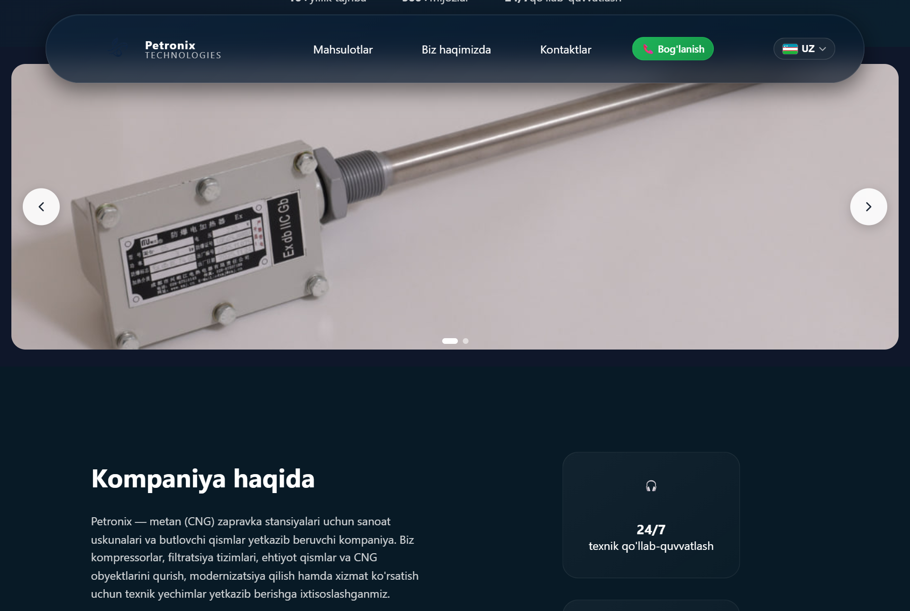

### 1.2. Переключение языка
В правом верхнем углу — переключатель с флагами: **🇺🇿 O'zbek**, **🇷🇺 Русский**, **🇬🇧 English**. Весь сайт переключается сразу, выбор запоминается.

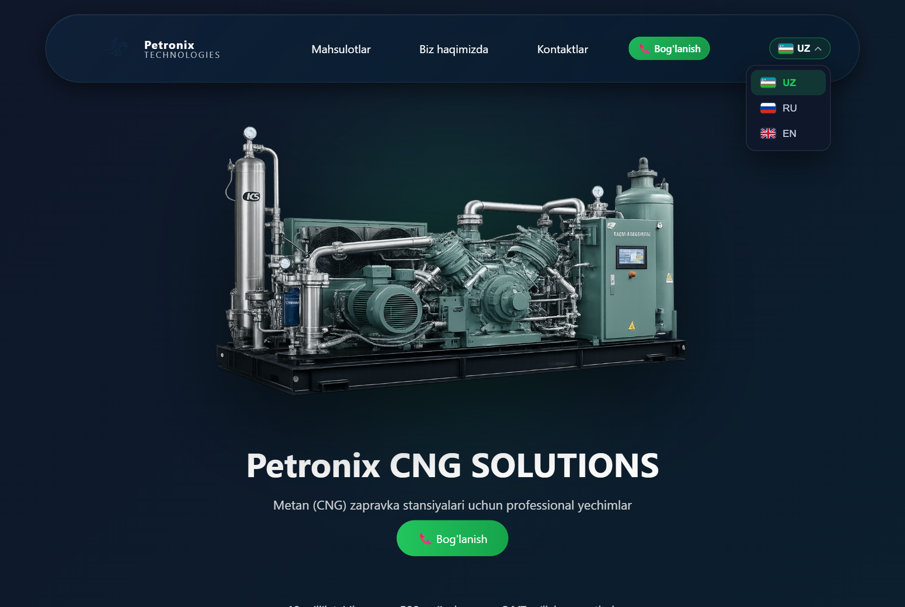

### 1.3. Каталог: фильтр и поиск
Раздел **Mahsulotlar / Товары** (`/products`). Слева — категории; при выборе категории раскрываются её подкатегории. Над списком — поиск по названию. Фильтр и поиск работают на сервере, товары подгружаются кнопкой **«Показать ещё»**.

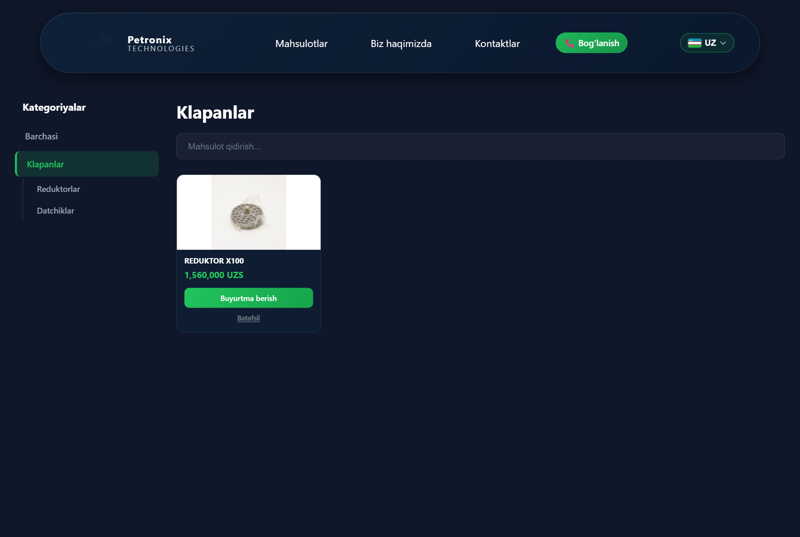

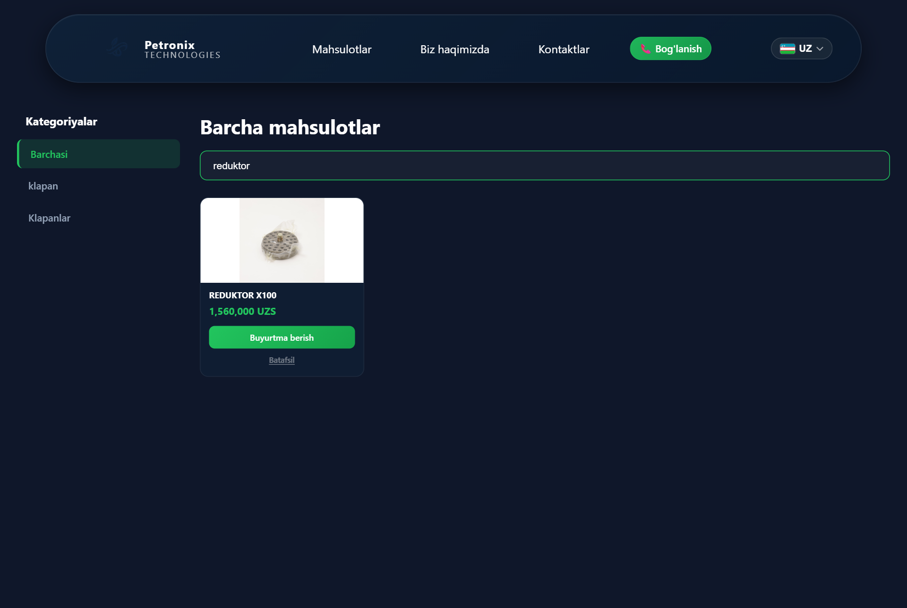

### 1.4. Корзина и оформление заказа
Кнопка **«Savatga qo'shish / В корзину»** на карточке товара добавляет его в корзину (счётчик — в шапке, иконка корзины). На странице **`/cart`**:
- меняешь количество (`−` / `+`), удаляешь позиции;
- видишь итоговую сумму;
- заполняешь имя, телефон, адрес и нажимаешь **«Оформить заказ»**.

Регистрация для заказа не нужна — оформляется как гость. После отправки появляется подтверждение с номером заказа; менеджер связывается с тобой.

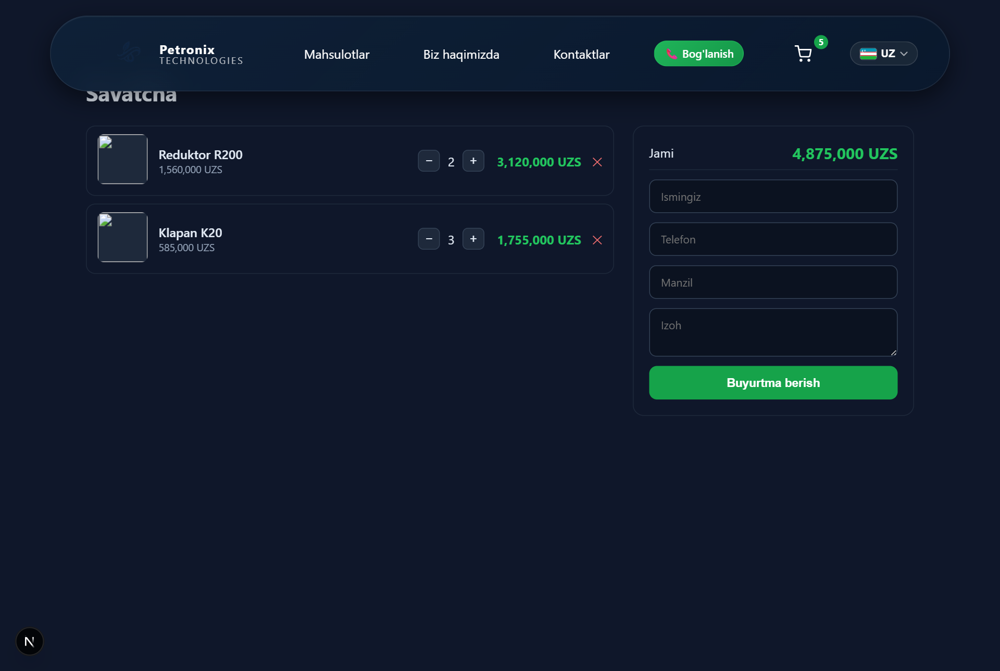

---

## Часть 2 — Для продавцов (дилеров)

Дилер — продавец со своим кабинетом: ведёт **свои** товары, видит **свои** заказы и остатки.

### 2.1. Регистрация
`https://petronix.uz/register` — имя, email, пароль (мин. 8 символов). Аккаунт создаётся с ролью **продавец (DEALER)**, дальше попадаешь в кабинет.

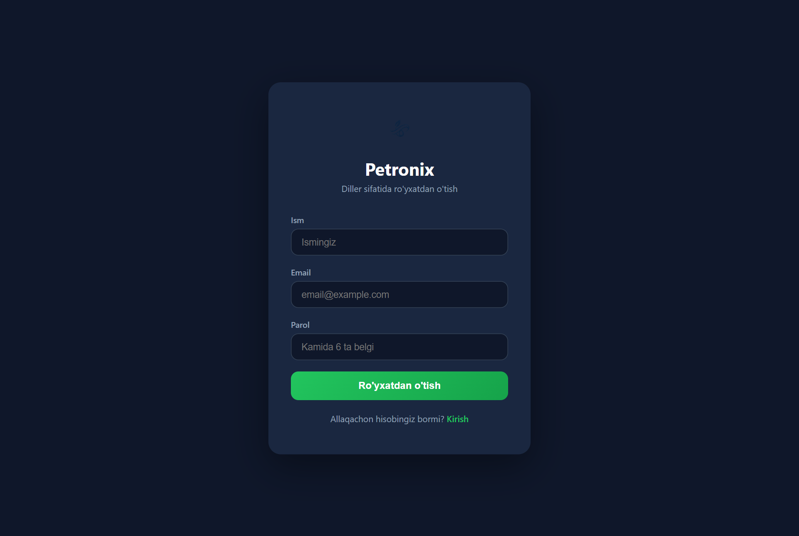

### 2.2. Вход
`https://petronix.uz/login` — email и пароль. Внизу — ссылки между входом и регистрацией.

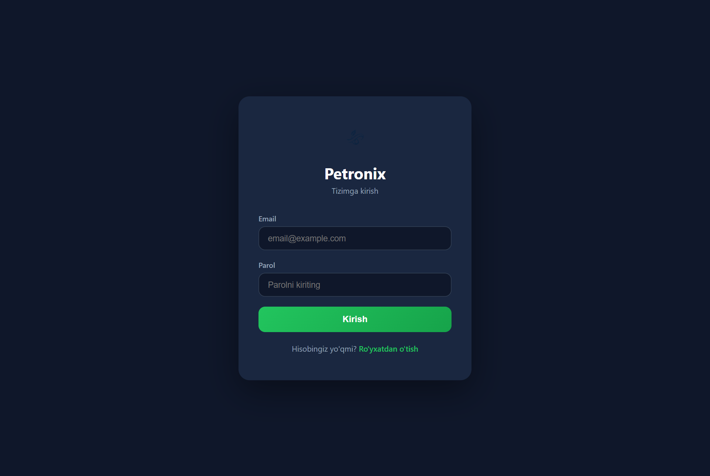

### 2.3. Кабинет: товары и заказы
После входа доступны разделы **Mahsulotlar** (товары), **Buyurtmalar** (заказы) и **Ombor** (склад) — но всё **только по своим** товарам.

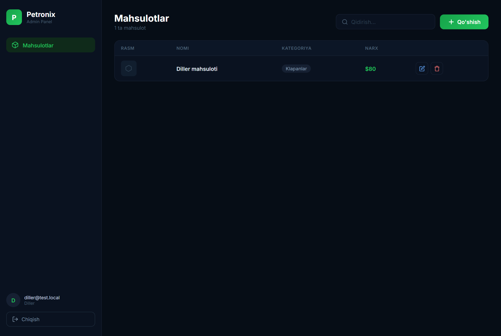

- **Mahsulotlar:** кнопка **«Qo'shish»** — название (3 языка), категория/подкатегория, цены, фото. Видны и редактируются только свои товары.
- **Buyurtmalar:** заказы, содержащие твои товары (только твои позиции). Статус заказа меняет администратор.
- **Ombor:** остатки и движения по твоим товарам.

---

## Часть 3 — Для администратора

Админу доступно всё: заказы, склад, отчёты, товары всех продавцов, категории и карусель.

### 3.1. Заказы (раздел «Buyurtmalar»)
Список всех заказов: клиент, телефон, сумма, оплата, статус. По заказу можно:
- раскрыть состав (позиции, количество, суммы);
- сменить **статус**: Yangi → Tasdiqlangan → To'langan → Jo'natilgan → Bajarilgan (или Bekor qilingan);
- нажать **«To'lovni tasdiqlash»** — отметить заказ оплаченным.

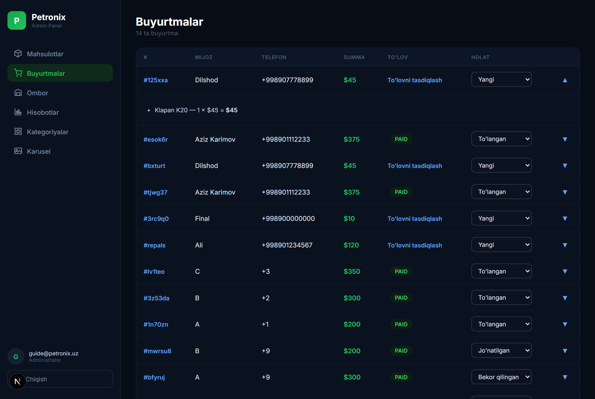

> При переходе заказа в «подтверждён/оплачен» товар автоматически списывается со склада; при отмене — возвращается.

### 3.2. Склад (раздел «Ombor»)
- **Остатки:** товар, количество, минимум, стоимость остатка; низкие остатки подсвечиваются.
- **+ Kirim (приход):** выбираешь поставщика и позиции (товар, кол-во, закупочная цена) → проведение увеличивает остаток.
- **+ Yetkazib beruvchi:** добавить поставщика.
- **Tuzatish / Chiqarish:** ручная корректировка остатка или списание.
- **История движений:** все операции (приход, продажа, списание, корректировка).

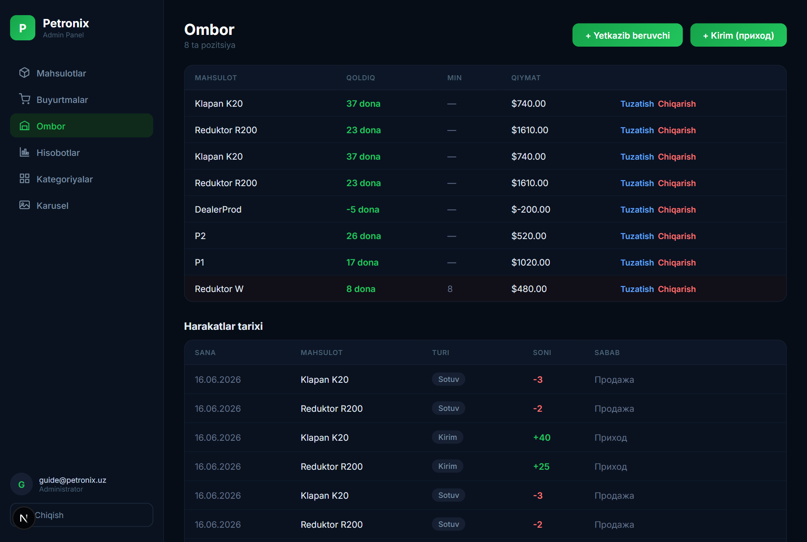

### 3.3. Отчёты (раздел «Hisobotlar»)
Выбираешь период и отчёт; есть выгрузка в CSV:
- **Sotuvlar** — выручка, кол-во заказов, средний чек по дням;
- **Qoldiqlar** — остатки и их стоимость, низкие остатки;
- **Foyda** — прибыль и маржа (розница − закупка);
- **Aylanma** — обороты по категориям или по дилерам.

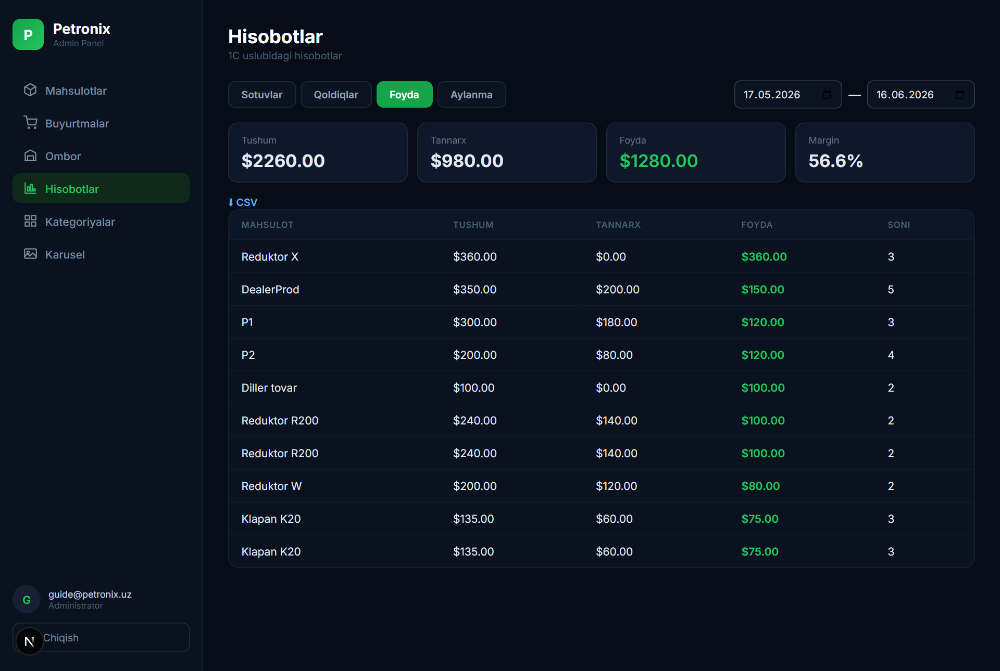

### 3.4. Карусель (раздел «Karusel»)
Загрузка/удаление баннеров главной страницы (JPEG/PNG/WebP, до 5 МБ). Не зависит от категорий.

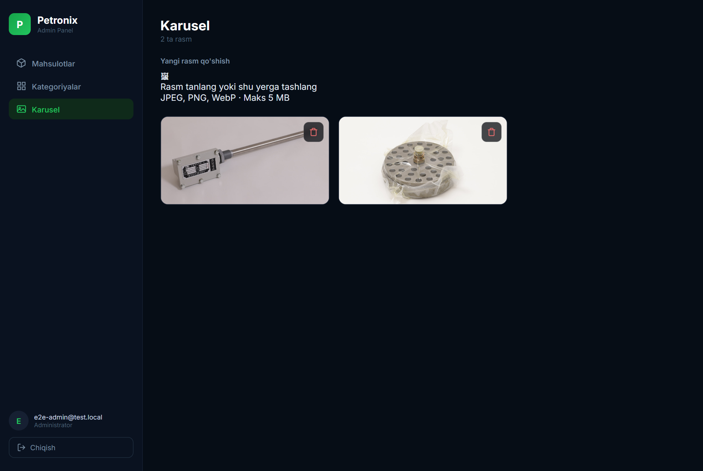

### 3.5. Категории и подкатегории (раздел «Kategoriyalar»)
**«+ Qo'shish»** для категории (название на 3 языках + slug). Внутри карточки — блок **«SUBKATEGORIYALAR»** для подкатегорий. ✏️ / 🗑 — редактировать/удалить (удаление категории удаляет её подкатегории).

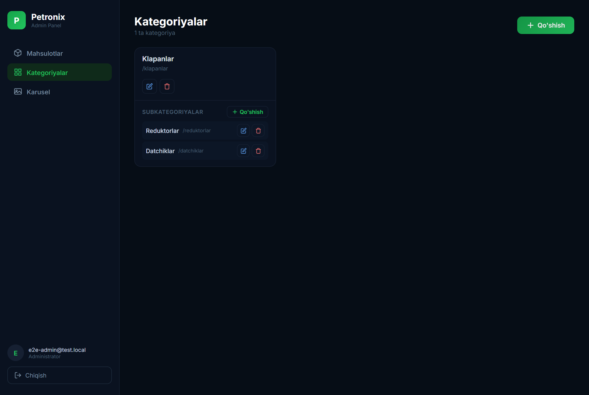

### 3.6. Товары
**Mahsulotlar → «Qo'shish»**. Выбор категории → появляется поле подкатегории. Заполняешь названия/описания (3 языка), цены (закупка, розница, опт), фото.

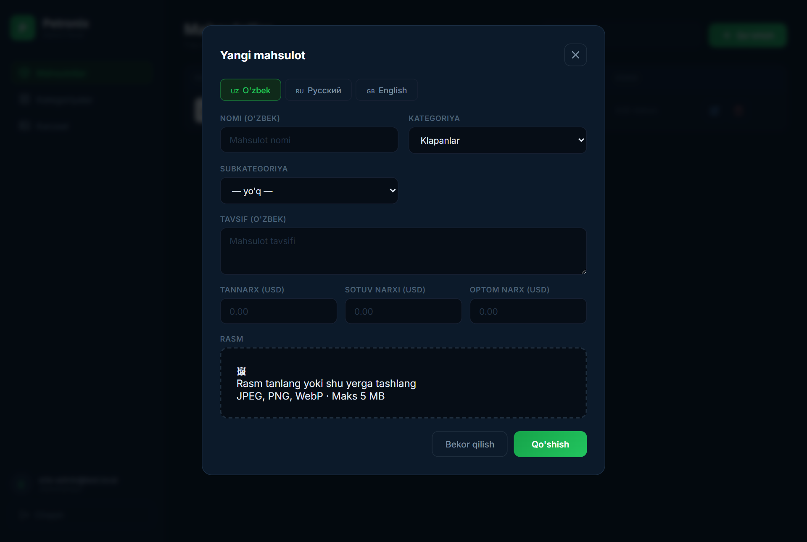

---

## Коротко: кто что может

| Действие | Клиент | Продавец | Админ |
|---|:---:|:---:|:---:|
| Каталог, поиск, корзина, оформление заказа | ✅ | ✅ | ✅ |
| Переключение языка | ✅ | ✅ | ✅ |
| Регистрация / вход | — | ✅ | ✅ |
| Свои товары | — | ✅ | ✅ |
| Свои заказы и остатки | — | ✅ | ✅ |
| **Все** заказы, смена статуса, оплата | — | — | ✅ |
| Склад: приход, списание, поставщики | — | — | ✅ |
| Отчёты (продажи/остатки/прибыль/обороты) | — | — | ✅ |
| Категории, подкатегории, карусель | — | — | ✅ |
